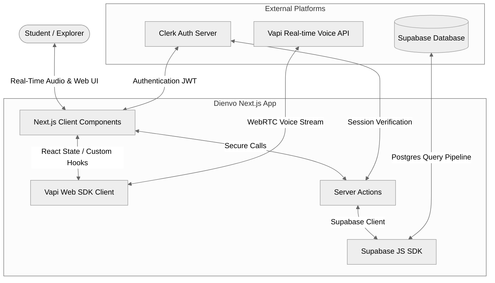
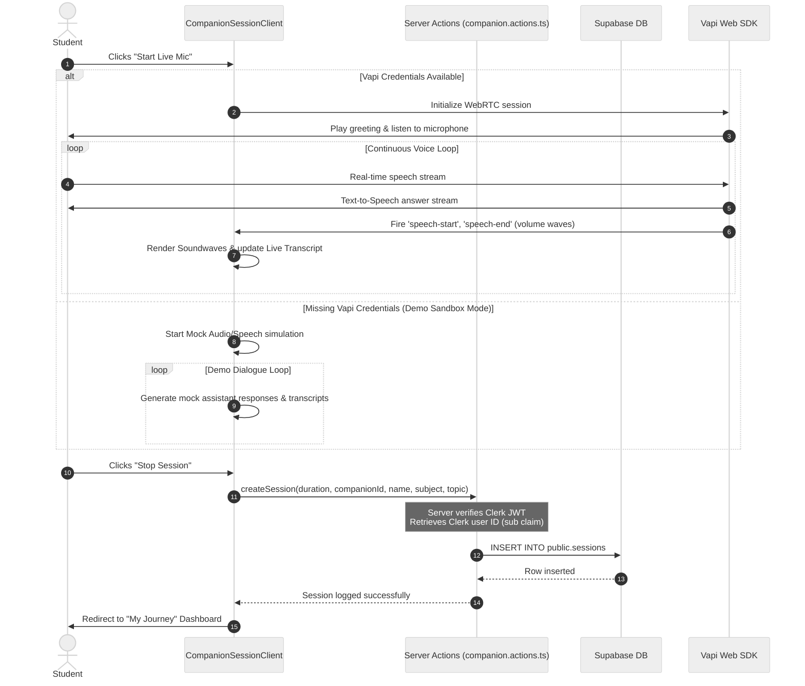
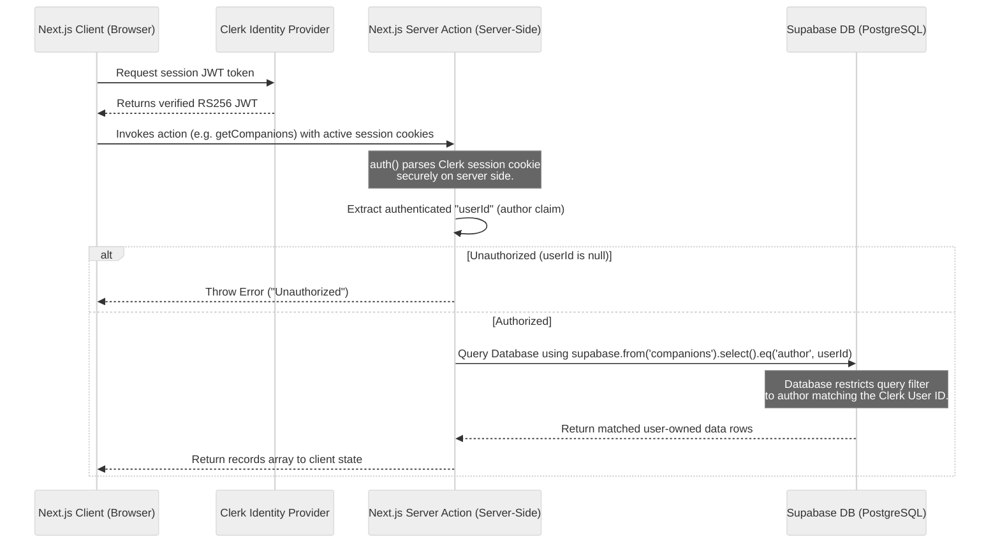
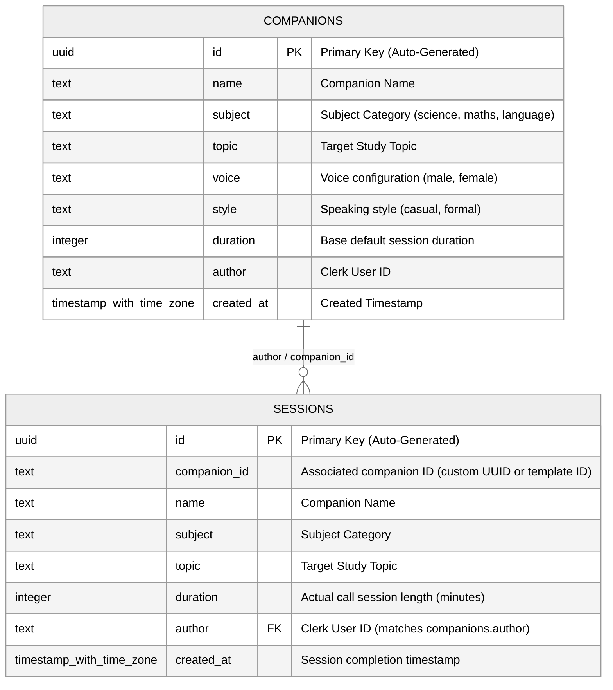
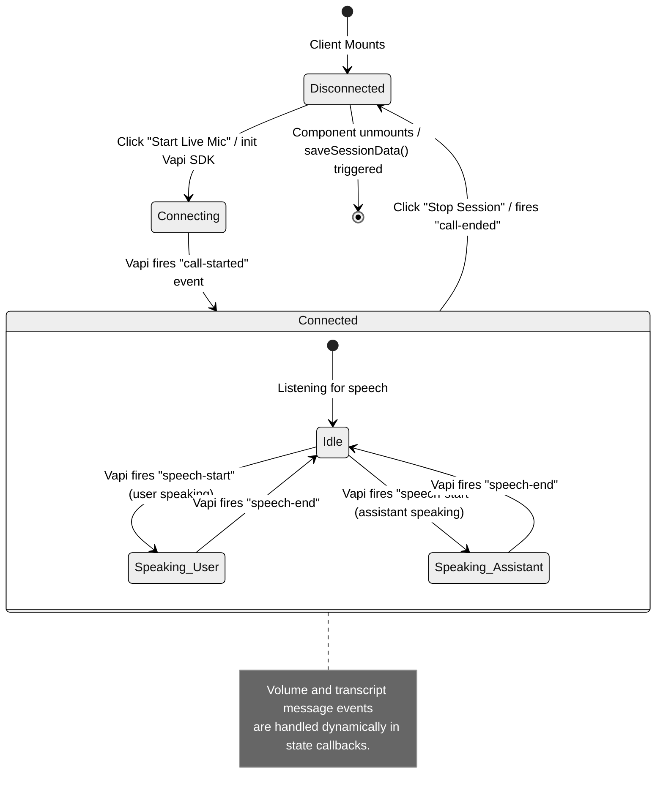

# Dienvo — AI Voice Teaching Platform SaaS

Dienvo is a premium, real-time AI Voice Teaching Platform SaaS designed to help students study academic topics through dynamic, spoken natural language conversations. It leverages Next.js 15, Clerk for secure user authentication, Supabase for robust database storage with Row-Level Security (RLS), and the Vapi Web SDK for low-latency, real-time voice call simulations.

---

## 🏗️ System Architecture

Dienvo is built on a modern, decoupled architecture connecting client-side state, server actions, identity providers, database backends, and low-latency audio processing pipelines.

### 1. High-Level Technical Architecture



### 2. Live Session & Data Lifecycle



### 3. Detailed Security & Data Isolation Architecture

To maintain secure tenant isolation, Dienvo coordinates Clerk JWT identification tokens with Next.js Server Actions and Supabase Row Level Security (RLS) policies:



#### Key Architecture Benefits:
* **Decoupled Database Key Execution**: By executing queries via Server Actions, the system bypasses complex Clerk-to-Supabase custom JWT claim sync errors by keeping administrative query calls on the server (bound to the secret `SUPABASE_SERVICE_ROLE_KEY`) while strict programmatic filters (`.eq('author', author)`) restrict rows returned.
* **RLS Policies**: The Supabase schema is also fortified with Row-Level Security rules referencing `((select nullif(current_setting('request.jwt.claims', true)::json->>'sub', '')) = author)` as an active layer of defense.

### 4. Database Schema (Entity Relationship Diagram)

The schema defines two core tables with index optimizations targeting search and query performance on user IDs.



### 5. Live Call Client State Machine

The Voice Session Client manages real-time WebRTC audio events through Vapi Web SDK state triggers:



---

## 🌟 Key Features

1. **AI Companion Directory**: A rich catalog of educational voice companions categorized by subject (Science, Maths, Language).
2. **Custom Companion Studio**: Allows authenticated students to create personalized study companions, picking custom voices, dialogue styles, and learning objectives.
3. **Interactive Live Session UI**:
   - Live real-time audio visualization using lightweight Lottie animations.
   - Dynamic micro-animations representing speech volume input.
   - Real-time conversational dialogue transcript panel.
   - Automatic fallback Sandbox Mode to run full simulations when voice API credits are unavailable.
4. **My Journey Dashboard**: Personal learning statistics capturing total session minutes, learning progress charts, and historical logs of all completed studies.

---

## 🛠️ Technology Stack & Libraries

- **Framework**: [Next.js 15.5.4 (App Router)](https://nextjs.org/)
- **Authentication**: [Clerk NextJS SDK](https://clerk.com/)
- **Database Engine**: [Supabase Postgres Platform](https://supabase.com/)
- **Voice Pipeline**: [Vapi Web SDK Client](https://vapi.ai/)
- **Aesthetic Styling**: CSS Variable-based design system & TailwindCSS
- **Animation Framework**: Lottie Web for smooth, hardware-accelerated SVG animations

---

## 🚀 Step-by-Step Deployment Guide

Follow these steps to deploy Dienvo to production (e.g., on Vercel) and connect your backend services.

### Step 1: Database Setup (Supabase)

1. Create a new project in the [Supabase Dashboard](https://database.new).
2. Copy your **Supabase URL**, **Anon Key**, and **Service Role Key** (found under Project Settings > API).
3. Navigate to the **SQL Editor** in your Supabase Dashboard.
4. Open the SQL Schema file provided in this repository at: [supabase_schema.sql](file:///d:/Stuffs/Dienvo/supabase_schema.sql)
5. Paste the SQL query and click **Run**. This will:
   - Enable the `uuid-ossp` extension.
   - Create the `companions` and `sessions` tables.
   - Set up optimal indexes on user ID fields.
   - Configure **Row Level Security (RLS)** policies mapping authenticated Clerk user sub-claims securely.

### Step 2: Authentication Configuration (Clerk)

1. Create a new application in the [Clerk Dashboard](https://dashboard.clerk.com/).
2. Select **Google** and **Email** as the authentication sign-in providers.
3. Copy the **Publishable Key** and **Secret Key**.
4. Set up the redirection paths in Clerk settings (Paths > Sign-in and Sign-up paths):
   - **Sign In URL**: `/sign-in`
   - **Sign Up URL**: `/sign-up`
5. *For Production Deployments*: Once your frontend is hosted (e.g., on Vercel), add your production domain to the Clerk Application Allowed Redirect URIs.

### Step 3: Voice Assistant Setup (Vapi)

1. Open your [Vapi Dashboard](https://dashboard.vapi.ai/).
2. Retrieve your **Public Key** from the Account/API Key section.
3. If deploying custom server integrations, configure Vapi assistants to use your chosen voices (e.g. ElevenLabs, PlayHT, Deepgram).

### Step 4: Next.js Image Config (`next.config.ts`)

Next.js strict image optimizations require whitelisting Clerk's content delivery networks. Dienvo comes pre-configured for this. If you use custom external avatars or image storage providers, verify your [next.config.ts](file:///d:/Stuffs/Dienvo/next.config.ts) matches:

```typescript
import type { NextConfig } from "next";

const nextConfig: NextConfig = {
  images: {
    remotePatterns: [
      {
        protocol: 'https',
        hostname: 'img.clerk.com',
      },
      {
        protocol: 'https',
        hostname: 'images.clerk.dev',
      },
    ],
  },
};

export default nextConfig;
```

### Step 5: Deploying to Vercel

1. Push your code to a GitHub, GitLab, or Bitbucket repository.
2. Log in to the [Vercel Dashboard](https://vercel.com/) and click **Add New Project**.
3. Import your repository.
4. In the **Environment Variables** section, configure the following key-value pairs:

| Environment Variable | Description / Source |
| :--- | :--- |
| `NEXT_PUBLIC_CLERK_PUBLISHABLE_KEY` | Clerk Publishable Key (starts with `pk_`) |
| `CLERK_SECRET_KEY` | Clerk Secret Key (starts with `sk_`) |
| `NEXT_PUBLIC_CLERK_SIGN_IN_URL` | `/sign-in` |
| `NEXT_PUBLIC_CLERK_SIGN_UP_URL` | `/sign-up` |
| `NEXT_PUBLIC_SUPABASE_URL` | Your Supabase Project API endpoint URL |
| `NEXT_PUBLIC_SUPABASE_ANON_KEY` | Supabase Anon/Public API Key |
| `SUPABASE_SERVICE_ROLE_KEY` | Supabase Secret Service Role Key (Used securely in Server Actions) |
| `NEXT_PUBLIC_VAPI_PUBLIC_KEY` | Vapi Web SDK Public Key |

5. Click **Deploy**. Vercel will automatically build the client bundle and deploy serverless functions for Next.js Server Actions.

---

## 🧪 Running Locally & Testing

To test the application on your computer:

1. Clone this project repository.
2. In the root directory, create a `.env.local` file containing the environment variables listed in the table above.
3. Install dependencies:
   ```bash
   npm install
   ```
4. Start the local development server:
   ```bash
   npm run dev
   ```
5. Open [http://localhost:3000](http://localhost:3000) on your web browser.

### 💡 Sandbox Simulation Mode
If you do not have an active Vapi account or subscription, leaving `NEXT_PUBLIC_VAPI_PUBLIC_KEY` blank or unset in your `.env.local` will automatically trigger **Sandbox Simulation Mode**. 
In this mode:
- The UI mimics speech connection cycles.
- Mock dialogue logs, soundwaves, and visual voice pulses are simulated automatically.
- Session logs are still recorded inside Supabase, allowing you to test the complete, end-to-end data lifecycle locally without spending Vapi API credits.
